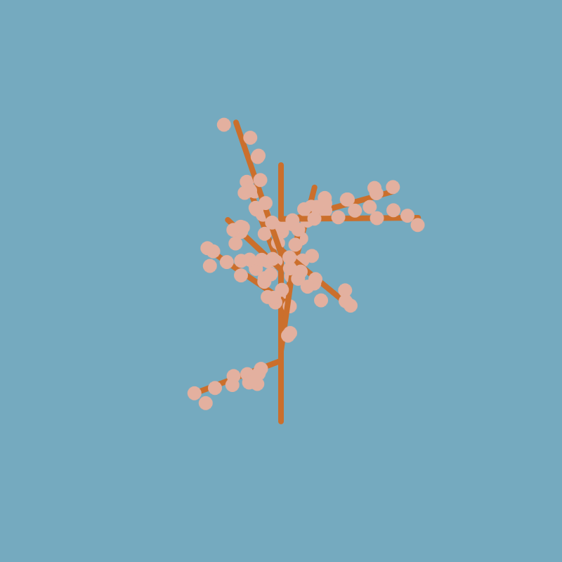

# Cherry Tree

Who doesn't love the Cherry Blossom season? (people with allergies maybe). This sketch generates a random Cherry tree in
one of the four season (lucky you if you get spring) from a unique identifier from your browser. This means that if you
open the side again it will produce the same tree each time. For this the first time you visit the website it stores a
small amount of information in your browser that is later read in future visits You may have heard something similar
when discussing cookies and internet tracking. And that is exactly what I wanted to illustrate with this sketch. You are
never truly anonymous on the internet, websites use a variety of techniques to track the websites you visit and
virtually follow you to serve you relevant ads.
